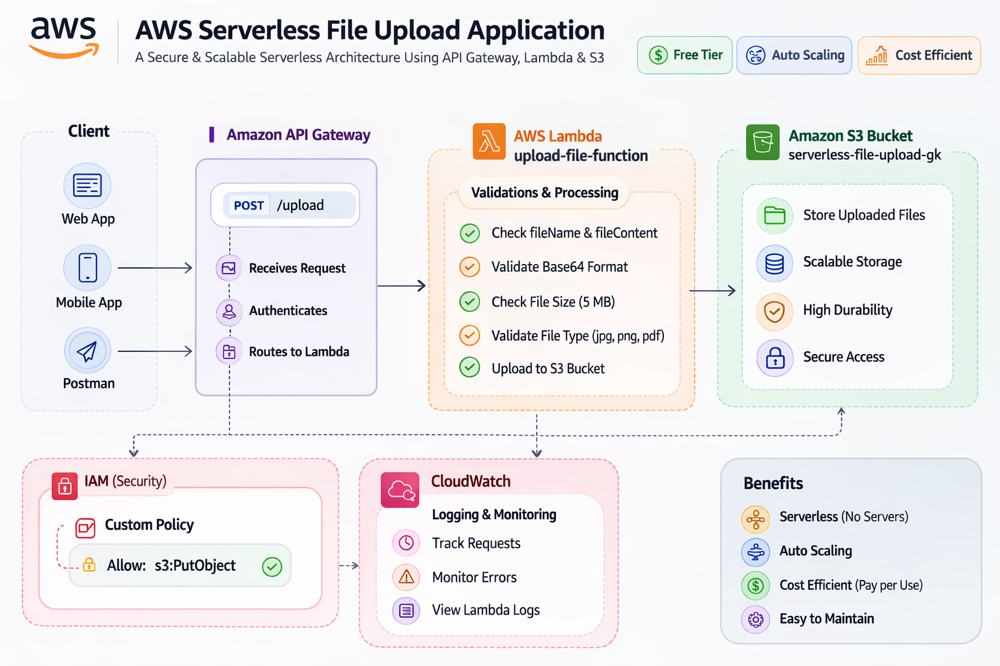

# AWS Serverless File Upload Application

## Project Overview
This project demonstrates a serverless file upload architecture built on AWS using API Gateway, Lambda, and S3.

Users upload files through an API endpoint, the Lambda function validates the request, and the file is stored securely in an S3 bucket.

---

## Architecture
Client → API Gateway → Lambda → S3

---

## AWS Services Used

- Amazon API Gateway
- AWS Lambda
- Amazon S3
- AWS IAM
- Amazon CloudWatch

---

## Features

- Serverless architecture
- Secure IAM least-privilege permissions
- File validation (type, size, base64)
- Error handling
- CloudWatch logging

---

## Security Best Practices

- IAM role restricted to `s3:PutObject`
- File size limit (5 MB)
- Allowed file types: jpg, png, pdf
- Input validation

---

## API Endpoint

POST /upload

Example request body:

{
  "fileName": "test.jpg",
  "fileContent": "BASE64_DATA"
}

---

## Architecture Diagram

---

## Future Improvements

- Pre-signed URL uploads
- CloudFront CDN
- S3 lifecycle rules